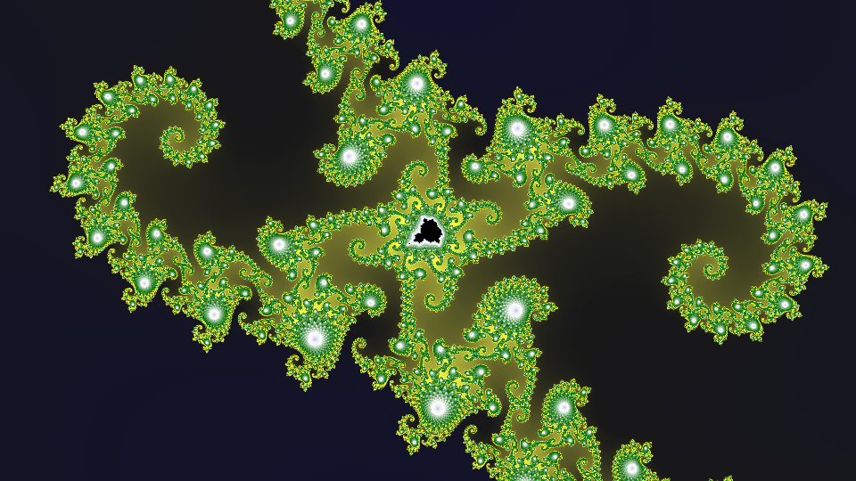

# Mandelbrot fractal generator in Rust

A Mandelbrot generator in Rust. This uses sampling and reconstruction techniques for generating high-quality images.

The part of the Mandelbrot set to render, the image size, and the sampling, filtering and coloring
options are all controlled from the command line. Run `mandelbrot --help` for the full list.

## Compiling

Compile this with:

    cargo build --release

Note: Build a release build. Without the `--release` option, Rust will build a debug build, which will run about 10 times as slow as a release build.

Included in this project is a `.cargo/config.toml` file which sets the option `-C target-cpu=native`, so that the build will be specifically optimized for the CPU in the computer you're compiling on.

## Running

After compiling, run this with:

    ./target/release/mandelbrot

With no arguments this quickly renders the whole Mandelbrot set to `mandelbrot.png`, at 1920x1080
with one sample per pixel, the box filter and the rainbow palette. Use the options to change the
view, image size, quality and colors; run `./target/release/mandelbrot --help` to see them all.

For a high-quality render, use the stratified sampler and the Mitchell filter, and zoom in on some
detail. For example, this render of the "seahorse valley" was made with:

    ./target/release/mandelbrot \
        --center-re -0.743643 --center-im 0.131825 --scale 0.00006 --max-iterations 10000 \
        --width 3840 --height 2160 --sampler stratified --samples 16 --filter mitchell \
        --palette table

For a high-quality render of the whole set at 4K:

    ./target/release/mandelbrot --width 3840 --height 2160 --sampler stratified --samples 16 --filter mitchell -o full.png

### Palettes

Choose the palette with `--palette` (`table`, `grayscale` or `rainbow`). The `table` palette
interpolates between color stops; by default it uses a built-in set of stops. You can supply your
own stops in a TOML file with `--palette-file`:

    ./target/release/mandelbrot --palette table --palette-file palette.toml

See [`palette.toml`](palette.toml) for the file format: a list of stops, each mapping a normalized
iteration value (`0.0 ..= 1.0`) to an `#RRGGBB` color, interpolated linearly in between.

### A gallery of interesting places

The Mandelbrot set is self-similar and endlessly detailed. Here are three places worth a look. The
script [`examples/gallery.sh`](examples/gallery.sh) renders all three at 1920x1080; the individual
commands are below.

A **mini-Mandelbrot**: a complete miniature copy of the whole set, hidden among the filaments.

    ./target/release/mandelbrot --center-re -0.1592 --center-im 1.0317 --scale 0.02 --max-iterations 1200 \
        --palette table --sampler stratified --samples 16 --filter mitchell -o minibrot.png

**Seahorse Valley**: interlocking spiral "seahorse tail" shapes between the cardioid and the main bulb.

    ./target/release/mandelbrot --center-re -0.7453 --center-im 0.1127 --scale 0.0055 --max-iterations 1500 \
        --palette table --sampler stratified --samples 16 --filter mitchell -o seahorse.png

**Elephant Valley**: a parade of spiral "elephant" trunks along the right side of the cardioid.

    ./target/release/mandelbrot --center-re 0.3 --center-im 0.02 --scale 0.02 --max-iterations 800 \
        --palette table --sampler stratified --samples 16 --filter mitchell -o elephant.png
