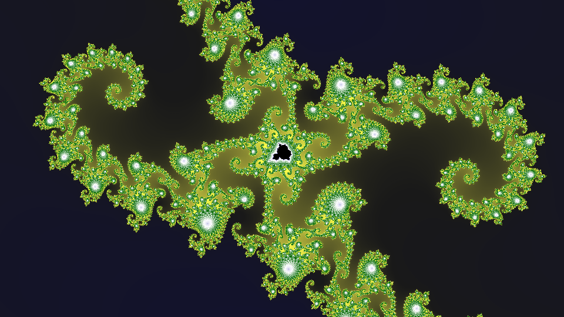

# Mandelbrot fractal generator in Rust

A Mandelbrot generator in Rust. This uses sampling and reconstruction techniques for generating high-quality images.

Edit the parameters in `main.rs` for rendering different parts of the Mandelbrot set etc.

## Compiling

Compile this with:

    cargo build --release

Note: Build a release build. Without the `--release` option, Rust will build a debug build, which will run about 10 times as slow as a release build.

Included in this project is a `.cargo/config.toml` file which sets the option `-C target-cpu=native`, so that the build will be specifically optimized for the CPU in the computer you're compiling on.

## Running

After compiling, run this with:

    ./target/release/mandelbrot

This will produce an image like this:

